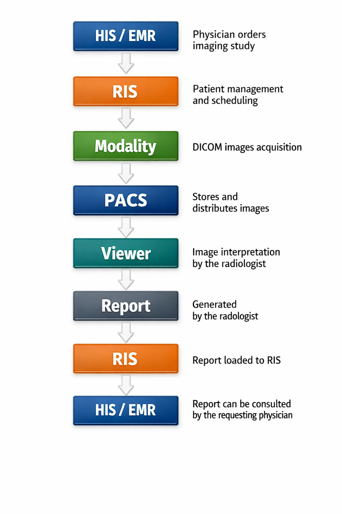

This document explains the basic workflow of a radiology study.

# CLINICAL IMAGING WORKFLOW



```
[HIS/EMR] --> Physician orders imaging study
     |
     v
    [RIS] ---> Patient management and scheduling
     |
     v
[Modality] ---> DICOM images acquisition. 
     |
     v
    [PACS] --> Stores and distributes images.
     |
     v
    [Viewer-PACS] --> Image interpretation by the radiologist 
     |
     v
  [Report] --> Generated by the radiologist
     |
     v
  [RIS] --> Report loaded to RIS. 
     |
     v
[HIS/EMR]  --> Report can be consulted by the requesting physician
```

# SYSTEM COMPONENTS

## EMR - Electronic Medical Record
Function: The treating physician generates an order for the radiology department and transfers it to the RIS.
Associated protocol: HL7

##  RIS - Radiology Information System
Function: RIS is the computer system that contains the schedule and demographic data of patients for the radiology department. When the order arrives, it assigns the “Accession Number” for the specific patient study and adds it to the radiology worklist with all the information contained in the request. The Accession Number identifies the imaging study and links all images and reports associated with that order.
Associated protocol: HL7 

## Modality = Image acquisition equipment. 
Function: The modality retrieves the DICOM Modality Worklist (MWL) from the RIS to obtain the demographic data and the Accession Number of the study.
Before obtaining the images, radiology technicians select the patient from the worklist, ensuring that the demographic information [age, sex, date of birth, patient name] and request information [modality and procedure, medical record number] are correct.
After the study is completed, the images are sent to the PACS. 
Associated protocol: DICOM 
** DICOM comes from "Digital Imaging and Communications in Medicine" and is the international standard for the management, storage, printing, and transmission of medical images. 

## PACS - Picture Archiving and Communication System
Function: The PACS receives the images, indexes them using the Accession Number, and stores them for short and long-term consultation, retrieval, and viewing. In other words, the images obtained are stored in the PACS so that the radiologist can later call them up from the reading worklist for interpretation.
Associated protocol: DICOM 

## Viewer
Function: Allows you to open, view, and analyze DICOM images from studies using different tools. Interpretation is performed on interpretation monitors located in the interpretation room, which is dimly lit with blue light to improve contrast detection and avoid reflections that could lead to interpretation errors. The viewer is often integrated into the PACS.

## Report generation software
Function: The radiologist dictates the report of the reviewed study, opened in the viewer; and when ready, adds it to the patient's EMR where it can be consulted by the treating physician.
Associated protocol: HL7 ORU (Observation Result).

Note:
Imaging tests are highly sensitive and can detect some diseases (such as cancer) at the most curable stage. However, they can also produce a high rate of false positives and a phenomenon called “overdiagnosis.” Patients have the right to ask questions about any aspect of the clinical study.

# KEY IDENTIFIERS IN IMAGING WORKFLOW
These identifiers are essential to prevent patient mismatches and ensure traceability across interconnected systems using HL7 and DICOM standards.

### Patient ID
Unique identifier assigned to the patient within the healthcare institution.
Associated with the patient's medical record in the EMR/HIS and used across RIS, PACS, and modalities to match studies to the correct patient.

### Accession Number
Unique identifier assigned by the RIS to a specific imaging order.
Links the order, images, and report for a single study requested by the physician.

### Study Instance UID
Globally unique DICOM identifier assigned to the entire imaging study.
Groups all series and images that belong to the same study.

### Series Instance UID
Unique DICOM identifier assigned to each series within a study.
A new series is created when acquisition parameters change (e.g., sequence type, orientation, contrast use).

# REFERENCES

Radiology workflow overview - 
Curogram. (2025, 20 mayo). Master Radiology Workflow Optimization: The Ultimate Guide to Efficient Medical Imaging Workflows. Curogram. [Enlace] ( https://curogram.com/blog/mastering-radiology-workflow-optimization-medical-imaging )

HIMSS imaging informatics workflow -
Towbin, A. J., Roth, C. J., Bronkalla, M., & Cram, D. (2016). Workflow Challenges of Enterprise Imaging: HIMSS-SIIM Collaborative White Paper. Journal Of Digital Imaging, 29(5), 574-582. [Enlace] ( https://doi.org/10.1007/s10278-016-9897-6 )

“Radiology workflow RIS PACS explained” - The Imaging Workflow Lab. (2026, 5 enero). Full radiology workflow explained: EMR → RIS → DICOM → PACS → Final Report [Vídeo]. YouTube.  [Enlace] (https://www.youtube.com/watch?v=HGlUnZjvixA)

Radiological Society of North America (RSNA) and  American College of Radiology (ACR). (s. f.). Los estudios clínicos y la detección temprana: todo lo que necesita saber. Radiologyinfo.org. [Enlace] ( https://www.radiologyinfo.org/es/info/screening-clinical-trials )
