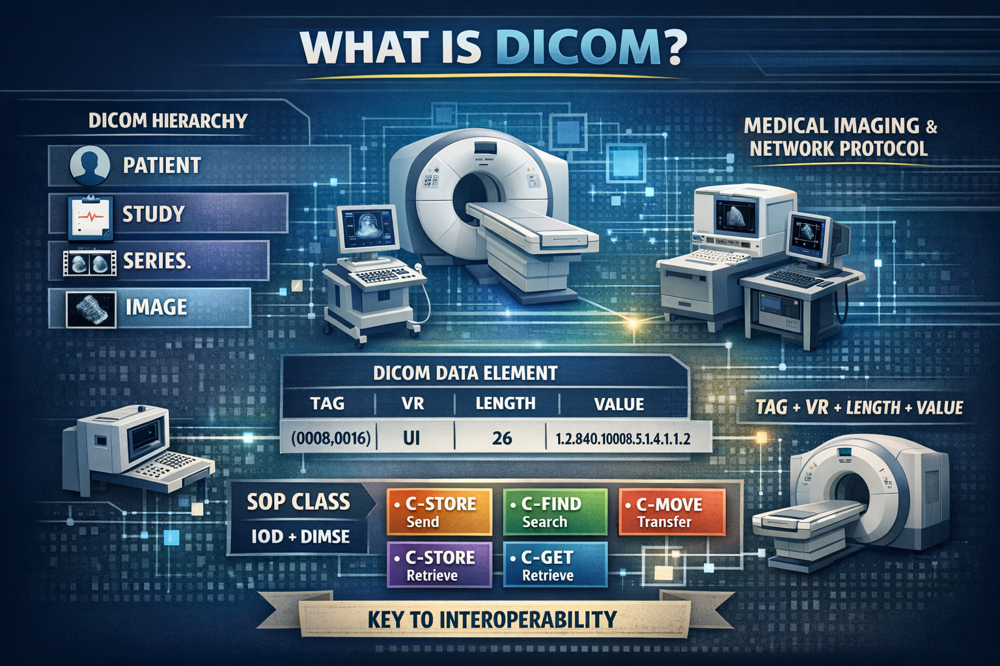

This document explains th basic concepts of DICOM standar. 

# WHAT IS DICOM?
Digital Imaging and Communications in Medicine — is the international standard for handling medical images and related information. 

It defines:
1.  The formats for medical images that can be recorded, stored and transmitted with the data and quality necessary for clinical use. 
2.  A network protocol for communication between medical imaging devices.

First published in 1993 and recognized by the International Organization for Standardization as ISO 12052.

# THE 4 HERARCHIES OF DICOM

Every DICOM object follows the Patient–Study–Series–Instance information model.

1. **Patient** - Stores patient demographic and identification information; including name, date of birth, age and gender.
2. **Study** - It is the imaging examination.  Patients can have multiple procedures, so they can have one or more studies. Data recorded under the study tier includes date, time, requester, location. 
3. **Series** - A series are the images acquired under the same protocol and equipment settings. One study can include several series or variations of the exam. Details recorded for each series includes date, time and modality. 
4. **Image** - Are the images corresponding to each serie. Also called “instances” because each image is an instance of the DICOM object. Patient, study and series information adds context to these medical images.

# DICOM OBJECTS : TAG + VR + LENGTH + VALUE 

A DICOM file or object is a list of attributes, each of them composed of the following parts:
1. A **tag** that identifies the attribute, usually in the format (XXXX,XXXX) with hexadecimal numbers, and composed by: 
 * DICOM Group Number  - Attribute  category 
 * DICOM Element Number
Examples:
(0010,0020): Group 0010 → Patient category, Element 0020 → Patient ID. 
(0008, 0060): Group 0008 → Study level metadata, Element 0060 → modality. 
(0008,0016) : Group 0008 → Study level metadata, Element 0016 → SOP Class UID.  Where is indicated the SOP Class, key for interoperability.
Tags can be consulted in
[Enlace](https://www.dicomlibrary.com/dicom/dicom-tags/)
2. A DICOM **Value Representation (VR)** that describes the data type and format of the attribute value. VR tells you how to interpret the value; it does not store the pixels itself.
Examples: PN → Person Name, DA → Date, UI → Unique Identifier, OW/OB → binary data (pixel data).
3. **Length**  how many bytes does the value occupies.
4. **Value**  the data. 

# SERVICE -OBJECT PAIR (SOP) CLASS : KEY FOR INTEROPERABILITY
A SOP Class is defined by the combination of:
1. An **IOD**  (Information Object Definition) - Defines which attributes a type of DICOM object should contain (ex. CT images, MR images, schedule list, print queues...): obligatory tags, optional tags and their organization in modules. 
2. A **DIMSE** (DICOM Service Elements) as: 
C-STORE → send object for remote storage
C-FIND → search for studies/metadata
C-MOVE → request another entity to transfer images to a third destination
C-GET → request transfer directly to the requesting entity

SOP Class UID example:
(0008,0016) SOP Class UID = 1.2.840.10008.5.1.4.1.1.2
This UID corresponds to the CT Image Storage SOP Class, indicating that the object follows the CT Image IOD and is intended for storage and transfer using the C-STORE service.

SOP Class UID can be consulted in 
[Enlace] (https://www.dicomlibrary.com/dicom/sop/)

Note:
In documentation and viewers, DICOM attributes are often displayed in a human-readable form (Tag + Name + Value), while the underlying file structure includes Tag + VR + Length + Value.
(0008,0016) — Tag
UI           — VR (Unique Identifier)
Length       — bytes que ocupa el UID
Value        — 1.2.840.10008.5.1.4.1.1.2

# REFERENCES 

About DICOM- Overview. (s. f.). DICOM.[Enlace] ( https://www.dicomstandard.org/about)

Key concepts. (s. f.). DICOM. [Enlace] (https://www.dicomstandard.org/concepts)

MedDream. (s. f.). DICOM Library - Anonymize, Share, View DICOM files ONLINE. Copyright (C) 2010 MedDream.  All Rights Reserved. [Enlace] (https://www.dicomlibrary.com/dicom/dicom-tags/ )

MedDream. (s. f.-a). DICOM Library - About DICOM SOPs. Copyright (C) 2010 MedDream.  All Rights Reserved. [Enlace] ( https://www.dicomlibrary.com/dicom/sop/ )

The 4 Hierarchical Levels of DICOM. (s. f.). [Enlace] ( https://www.candelis.com/blog/dicom-hierarchy )
