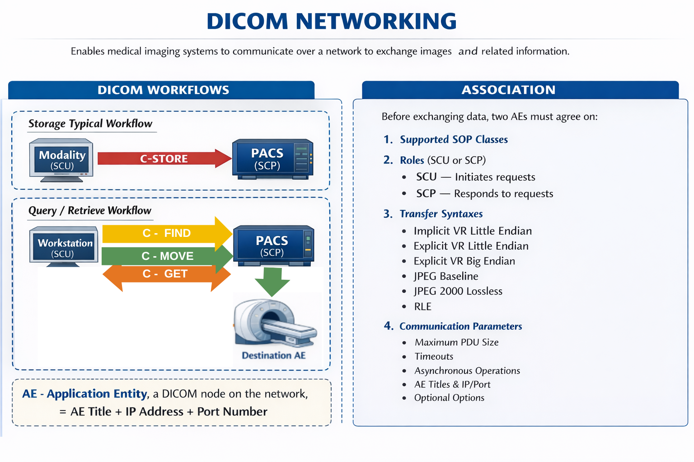

# DICOM NETWORKING IN CLINICAL PRACTICE 

DICOM networking enables medical imaging systems to communicate over a network to exchange images and related information. This capability allows modalities, PACS servers, and workstations to operate as an integrated ecosystem rather than isolated devices.

DICOM networking enables centralized image storage, distribution of studies across departments, teleradiology and interoperability between vendors.

## Core Concepts

### AE - Application Entity  

Is a DICOM node on the network.
Examples of AEs: imaging modalities (CT, MRI, Ultrasound), PACS servers, viewing workstations. 

Each AE is identified by three parameters:
1. AE Title — unique identifier of the node
2. IP Address — network location
3. Port Number — communication endpoint
These three values must be configured correctly for communication to occur.

### Association  

Before exchanging data, two AEs must establish an Association, which is a negotiated connection.
During association negotiation, the systems agree on:
1. Supported SOP Classes
2. Roles (SCU or SCP)
3. Transfer syntaxes - how DICOM data will be encoded during transmission. Defines a) data encoding format and b) compression, common examples:
     * Implicit VR Little Endian - without VR specification.
     * Explicit VR Little Endian - with	VR specification. 
     * Explicit VR Big Endian - with	VR specification. (Endian = how bytes are ordered within multibyte data; in Big Endian, the most significant byte comes first (Ex. the hexadecimal number 0x1234 is transmitted as 12 34) and in Little Endian, the least significant byte comes first (Ex: 0x1234 is transmitted as 34 12).)
     * JPEG Baseline (Process 1) - Compress images with JPEG baseline, reducing image size.
     * JPEG 2000 Lossless - Lossless compression with JPEG 2000.
     * RLE Lossless Run-Length Encoding - Lossless compression method; if there are many identical values in a row, it replaces them with a value + number of repetitions.
4. Communication parameters- define how Transmission Control Protocol /Internet Protocol (TCP/IP) communication between AEs is established and maintained, including:
    * Maximum PDU Size - maximum number of bytes in a DICOM package
    * Timeouts: How long does an AE wait for a response before aborting
    * Asynchronous Operations: maximum number of simultaneous operations that can be sent without waiting for a response.
    * AE Titles y dirección IP/puerto: Identification of participating AEs.
    * Optional communication options: secondary role negotiation, windowing, or support for protocol-specific options...

If negotiation fails, no data exchange occurs.

### SCU and SCP Roles
Each participant in an association assumes a role:

SCU — Service Class User : Initiates requests (client role)
SCP — Service Class Provider: Responds to requests (server role)

Roles are service-specific; a system can act as SCU in one interaction and SCP in another.

### DIMSE - Core DICOM Network Services 

DICOM networking uses standardized services known as DIMSE (DICOM Message Service Elements).

**C-STORE** — Storage Service: 
Transfers DICOM objects for storage. 
Modality (SCU) → PACS (SCP).
**C-FIND**  — Query Service
Searches for studies, series, or images based on metadata.
Viewer (SCU) → PACS (SCP)
**C-MOVE** — Retrieve Service (Third-Party Transfer)
Requests that images be sent to a specified destination AE. The requester does not receive the images directly.
Viewer (SCU) → PACS (SCP) → Destination AE
**C-GET** — Retrieve Service (Direct Transfer)
Retrieves images over the same association used for the request. 
Destination AE (SCU) → PACS (SCP)

## TYPICAL STORAGE AND QUERY/RETRIVE WORKFLOWS

Storage typical workflow: 
1. Modality acquires images
2. Modality initiates association with PACS
3. Images transmitted via C-STORE
4. PACS stores objects and indexes metadata

Query/Retrieve Workflow
1. Workstation queries PACS using C-FIND
2. User selects desired study
3. Images retrieved using C-MOVE or C-GET
4. Images displayed for interpretation

## REFERENCES

Association — pynetdicom 3.0.4 documentation. (s. f.). [Enlace] ( https://pydicom.github.io/pynetdicom/stable/user/concepts_association.html )

DICOM PS3.4 2026a - Service Class Specifications: [Enlace] (https://dicom.nema.org/medical/dicom/current/output/pdf/part04.pdf)

DICOM Standard Committee. DICOM Standard, Part 7: Message Exchange. National Electrical Manufacturers Association (NEMA), 2023.

DICOM Standard Committee. DICOM Standard, Part 4: Service Class Specifications. NEMA, 2023.

Clunie DA. DICOM Structured Reporting and Networking. PixelMed Publishing, 2013.

Bidgood WD, Horii SC. Understanding the DICOM Standard. Radiographics, 1992;12(2):345–356.