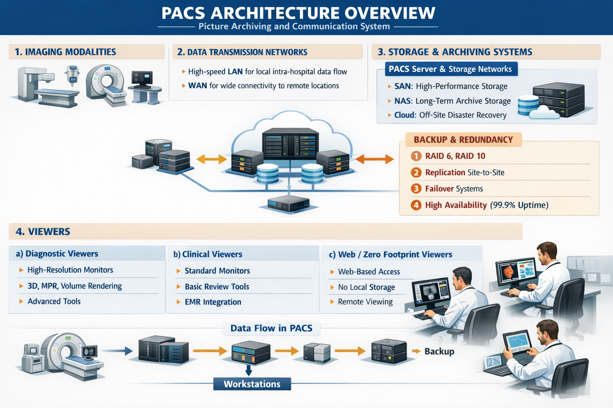

# PACS ARQUITECTURE OVERVIEW

A Picture Archiving and Communication System (PACS) is the core infrastructure that stores, manages, distributes, and displays medical images within a healthcare organization.

## CORE COMPONENTS OF PACS

### 1. IMAGING MODALITIES
Medical image acquisition devices that generate DICOM images: CT scanners, MRI scanners, X-ray systems, Ultrasound devices. These modalities send images to PACS using the DICOM C-STORE service.

### 2. DATA TRANSMISSION NETWORKS
A PACS network typically uses:
* a high-speed LAN (Local Area Network) for intra-hospital data flow and 
* a WAN (Wide Area Network) for connectivity to systems and to remote locations. 
This transmission allows real-time access to imaging studies by clinicians across multiple sites.
Whether it’s retrieving a study from the cloud PACS or sending it to a server on-site, the system requires consistent security measures: To comply with healthcare regulations and safeguard patient records, robust encryption and secure protocols are employed.  In addition, PACS provides ways to monitor network performance to prevent system failure.

### 3. STORAGE & ARCHIVING SYSTEMS
Also known as PACS Server, is a centralized system responsible for receiving images, indexing metadata, managing storage, handling query/retrieve requests. The server acts as the archive and communication hub.

### NAS & SAN - STORAGE NETWORKS
Medical images require reliable and scalable storage due to their size and clinical importance. The two types of storage networks used in enterprise environments are: 
  *  SAN — Storage Area Network
      - Typically used for primary (short-term) storage → active cases
      - Block-level storage
      - Very low latency, high throughput, high performance
      - Supports mission-critical workloads
      - Higher cost due to specialized infrastructure
  * NAS — Network Attached Storage.
      - Commonly used for secondary or long-term archive storage → nearline archive
      - File-level storage
      - Connected via Ethernet
      - Cost-effective and easier to manage
      - Suitable for less frequently accessed studies
  * Cloud
      - Additional storage tier 
      - Scalable, off-site storage for archive and disaster recovery
      - Enables remote access and business continuity → deep archive / DR

#### BACKUP & REDUNDACY KEY CONCEPTS
Because imaging data is critical, PACS includes mechanisms for data protection. These measures ensure continuity of clinical operations.

1. RAID Levels
   RAID (Redundant Array of Independent Disks) is a storage technology that combines multiple physical disks into a single logical unit to improve performance, fault tolerance, or both. Different RAID levels provide different balances between redundancy, performance, and storage efficiency:
   a) RAID 0 — Striping: No redundancy, high performance. Used only where data loss is acceptable.
   b) RAID 1 — Mirroring: Exact copy of data on two disks, high reliability. Common for critical system drives.
   c) RAID 5 — Striping with Parity: Distributed parity across disks, tolerates one disk failure. Efficient storage usage.
   e) RAID 10 — Mirroring + Striping: High performance and redundancy. Common in high-performance medical imaging systems.
In PACS environments, RAID protects against disk failure but is not a substitute for backup.

2. Replication (Site-to-Site)
    Replication is the process of copying data from one storage system to another, typically in a different physical location, to ensure data availability in case of disaster. Replication types are:
    * Synchronous replication - Data written simultaneously to both sites: Zero data loss (RPO = 0), requires high-speed low-latency links.
    * Asynchronous replication - Data copied with delay: Possible small data loss, more common for long distances.
In healthcare, site-to-site replication enables disaster recovery for PACS archives.

3. Failover
   Failover is the automatic switching to a standby system (backup archive server, secundary data center or activating redundant network paths) when the primary system fails, ensuring continuity of operations. Failover can be:
   * Automatic (preferred in healthcare)
   * Manual (requires administrator intervention)

4. High Availability (HA)
   High Availability (HA) refers to system design strategies that ensure continuous operation with minimal downtime. Key characteristics:
   * Redundant hardware components
   * Load balancing
   * Failover mechanisms
   * Continuous monitoring
   HA is measured as uptime:
   * 99.9% → ~8.7 hours downtime/year
   * 99.99% → ~52 minutes
   * 99.999% (“five nines”) → ~5 minutes
In medical imaging, HA is critical because system downtime can delay diagnosis and patient care.

### 4. VIEWERS
The viewers are the primary interfaces used to display, manipulate, and interpret medical images within a PACS environment. There are three main types:
a) Diagnostic viewers (radiologist workstations)
    Used for primary image interpretation by radiologists. Key features:
    - Medical-grade high-resolution monitors (often 3–5 MP or higher
    - Advanced visualization tools:
       + 3D reconstruction
       + Multi-planar reformatting (MPR)
       + Volume rendering
    - Measurements and annotations
    - Hanging protocols and comparison with prior studies
    - Integration with PACS, RIS, and reporting systems
    - Optimized performance for large datasets

b) Clinical viewers (physician viewing stations)
    Used by referring physicians and other clinicians for image review, not primary diagnosis. Key characteristics:
    -  Standard monitors (non-diagnostic grade)
    - Simplified interface
    - Basic tools (zoom, window/level, measurements)
    - Access integrated with EMR/HIS systems
    - Supports clinical decision-making and patient care

c) Web viewers / Zero Footprint Viewers (ZFP)
     A Zero Footprint Viewer is a web-based medical image viewer that requires no local software installation. Key characteristics:
     - Runs entirely in a web browser
     - No plugins required
     - No persistent local storage of patient data
     - Secure remote access
     - Cross-platform compatibility (PC, tablet, sometimes mobile devices)
     - Enables remote consultation and teleradiology

## Data Flow in PACS

1. Modality acquires images
2. Images transmitted to PACS
3. PACS stores and indexes images
4. Workstations query and retrieve studies
5. Radiologist interprets images

# REFERENCES

PACS System Key Components. (2024, 10 diciembre). RADSOURCE. Recuperado 27 de febrero de 2026, de https://radsource.us/pacs-system-key-components/

ManageEngine, communications@manageengine.com. (s. f.). Network Monitoring Software by ManageEngine OpManager. ManageEngine OpManager. https://www.manageengine.com/network-monitoring/tech-topics/san-vs-nas.html

Smith, H. Storage Networks Explained. Addison-Wesley.
PowerCert Animated Videos. (2015, 9 agosto). What is RAID 0, 1, 5, & 10? [Vídeo]. YouTube. https://www.youtube.com/watch?v=U-OCdTeZLac
PowerCert Animated Videos. (2024, 28 marzo). What is RAID Parity? [Vídeo]. YouTube. https://www.youtube.com/watch?v=BjuBloMHhKk

Oosterhof. PACS Fundamentals. OTech.

SNIA (Storage Networking Industry Association). Data Replication and Disaster Recovery Guide

Cisco Systems. High Availability Design Guide

HIMSS. Healthcare IT Infrastructure Guidelines