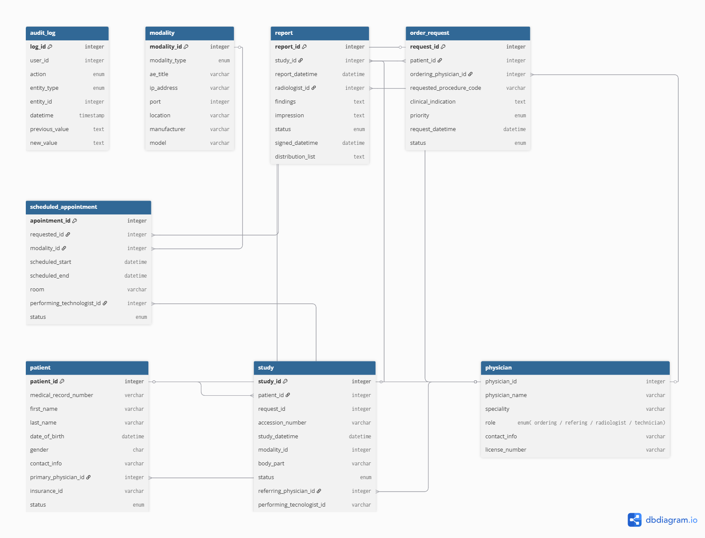

# RIS–PACS Integration in Clinical Practice

The integration between the Radiology Information System (RIS) and the Picture Archiving and Communication System (PACS) enables a coordinated workflow between administrative processes and medical imaging throughout the radiology workflow.

RIS manages patient data, scheduling, orders, and reports, while PACS manages image storage and distribution. Together, they form the operational backbone of radiology departments.

The Modality Worklist and Accession Number are key mechanisms that enable safe and efficient operation.

### RIS — Radiology Information System
RIS orchestrates the workflow of the radiology department.

Manages:
* Patient registration
* Scheduling
* Orders
* Study tracking
* Report generation

### PACS — Picture Arching and Communication System
PACS manages the imaging lifecycle.
Manages:
* Storage of medical images
* Distribution of studies
* Viewing and retrieval

## INTEGRATION WORKFLOW
### 1. Order Creation
a) A physician requests an imaging study in the hospital information system (HIS/EMR).
b) The order is sent to RIS via HL7 messages.
c) RIS assigns an **Accession Number** - A unique identifier for the requested imaging study.  This number is critical, it links the ddministrative data in RIS (order and report and the imaging data in PACS (images). -

### 2. Modality Worklist (MWL)

The DICOM Modality Worklist is the mechanism that connects RIS and imaging modalities. 

RIS provides a list of scheduled studies to the modality using DICOM MWL service with the purpose of eliminating manual data entry, reducing patient identification errors and ensuring consistancy across systems. 

d) RIS receives and schedules an order
f) RIS exposes the scheduled study via MWL
g) Modality queries MWL
h) Technologist selects the patient from the list
i) Study demographics are automatically populated :  Patient name, patient ID, date of birth, sex, scheduled procedure, accession Number. 

### 3. Image Acquisition and Linking
After acquisition:

j) Images are sent to PACS 
k) Each image includes the Accession Number.
l) PACS associates images with the correct study.

### 4. Interpretation and Reporting

m) Radiologists access studies in PACS by Accession Number.
n) Reports are generated in RIS and linked to the study using the Accession Number.
o) The final report is transmitted back to the EMR.

## RIS DATA MODEL —  Implementation Perspective.

RIS manages the lifecycle of an imaging request: order, scheduling, acquisition, reporting.
Each step has its own entity to preserve traceability, support rescheduling, and coordinate with PACS modalities via worklists and accession numbers.

This extended conceptual model reflects how RIS operates in clinical environments and integrates with PACS and HIS.

Core Entities:

* Patient - It represents the patient and serves as the root of all clinical information related to imaging procedures.Maintain integrity with the HIS for MRN (Medical Record Number). The FK to Physician allows you to report your primary care physician.
* Study - Represents an imaging procedure performed on the patient, linked to the request (Procedure Request) and the report (Report).The link to the Procedure Request allows the study to be traced back to the original order. The unique Accession Number ensures PACS-RIS traceability. 
* Report - It represents the result of the study, typically generated by the radiologist, and can be integrated with HIS/EHR via HL7 ORU messages.The status allows you to differentiate between drafts and final reports. Integration with electronic signature and audit trail systems is recommended. 

Extended Entities:

* Procedure Request (Order) - Often created via HL7 ORM message from HIS/EHR.
* Appointment (Scheduling) - Represents the scheduled time slot for the procedure; separates ordering from scheduling supporting rescheduling without losing the original order. 
* Modality - Represents imaging equipment.
* Physician - Represents clinicians interacting with the system. 
* Audit Log - Tracks system actions for compliance and traceability.

## REFERENCES

Milano, V. (2026, 3 marzo). RIS & PACS: Understanding How They Work Together. AbbaDox. https://www.abbadox.com/blog/ris-vs.-pacs-understanding-the-differences-and-how-they-work-together

PS3.2. (s. f.). DICOM. https://dicom.nema.org/medical/Dicom/2018d/output/pdf/part02_changes.pdf Copyright © 2018 NEMA

A Free Database Designer for Developers and Analysts. (s. f.). https://dbdiagram.io/d