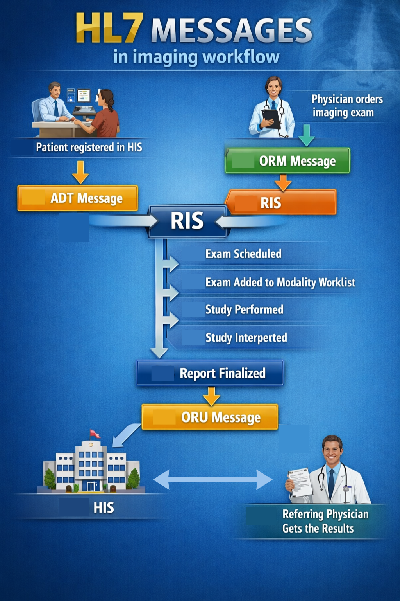

# HL7  BASICS

Health Level Seven (HL7) is a set of international standards for exchanging clinical and administrative data between healthcare systems. 

In radiology workflows, HL7 enables communication between EMR, HIS, RIS and Billing systems. 

While DICOM focuses on medical images and related metadata, HL7 focuses on text-based clinical messages that carries the operational data that imaging depends on:
* Patient demographics
* Orders for imaging exams
* Scheduling information
* Clinical results distribution

Without HL7, PACS would have images but no clinical context.

## CORE HL7 MESSAGE TYPES IN RIS WORKFLOWS
 
### ADT — Admission, Discharge, Transfer

ADT messages update patient demographics across systems, ensuring cosnsistent patient identity.
In events such as:
     * patient registration, 
     * admission to hospital, 
     * discharge, 
     * updates to patient information. 

### ORM — Order Message

ORM messages transmit imaging requests from HIS/EMR to RIS. This way, inicializing the imaging workflow. It often triggers the creation of procedure request in RIS, generation of **Accession Number**, scheduling process and inclusion in **Modality Worklist**.

Typical contents are : 
     * Requested procedure
     * Ordering physician
     * Priority
     * Clinical indication
     * Requested date/time

### ORU — Observation Result

ORU messages transmit the results by delivering the final radiology report with the clinical findings (observations and conclusions) back to HIS/EMR, where can be consulted by the referring physician.

## RIS–HIS WORKFLOW USING HL7

1. Patient registered in HIS → ADT message sent to RIS
2. Physician orders imaging exam → ORM message sent to RIS
3. RIS schedules exam and prepares worklist
4. Study performed and interpreted
5. Report finalized → ORU message sent back to HIS

HL7 integration issues are among the most common challenges during RIS deployment. Including patient identity management and mapping betweeb HIS and RIS fields.

## References

Health Level Seven International — Official HL7 organization